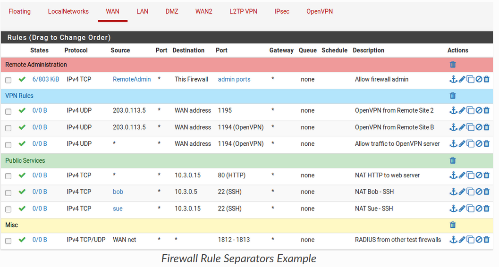
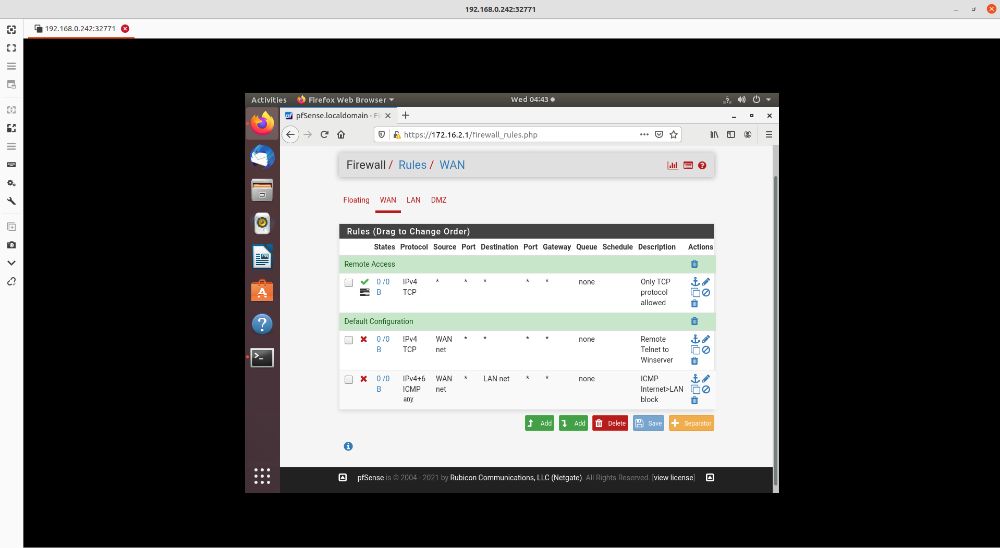

# Firewall Rules screen
+ The rules of firewall are located at: `Firewall → Rules`.
+ The default rules of WAN are: `Block private networks` and `Block bogon networks`.
+ The default of LAN rules allows all traffics inside of the network (Internal network).
+ There are mainly three states that we can see in each rules:
	+ 1. Pass (v)
	+ 2. Block (x)
	+ 3. Reject (x)

# Adding a firewall rule
+ To add a rule to the top of the list: click `(Up arrow) Add`.
+ To add a rule to the bottom of the list: click `(Down arrow) Add`.
+ To make a new rule that is similar to an existing rule, click `Copy` to the right of the existing rule.

# Editing Firewall rule
+ To edit a firewall rule, click `Edit` to the right of rule, or double click anywhere on the rule.

# Moving Firewall rule
+ Rule may be moved into 2 main ways: Drag-and-drop, and using select-and-click
+ The drag-and-drop will be the easy one. All we need to do is to drag the rule we want to change, then simply drop it to the desired location.

# Delete Firewall rule
+ To delete firewall rule, we simply click on `Delete` button next to the rule we want to delete.

# Disable and Enable Firewall rule
+ To disable the rule, simply click the `Disable` icon at the end of its row. We will notice that the appearance of the rule will be lighter shade, this indicates that the rule is successfully disabled.
+ To enable the rule we disable, simply click the `Enable` button at the end of its row. The appearance of the rule will return into normal.

# Rule Separators
+ Rule separators are used to separate the rule, this will group the rules into small groups, which makes the rules look neat and nice.

+ In order to create a rule separator:
	+ 1. Open the firewall rule tab.
	+ 2. Click `Add Separator` (Plus icon)
	+ 3. Add description, color ... to the rules
	+ 4. Click and drag rule separator to the desired location.
	+ 5. Save

# Tracking Firewall Rule Changes
+ Whenever we make change to the rule, there should always be a update board at the very end of the rule editing screen, which showcases the changes of rules.

# EVE-NG Firewall Example configuration

